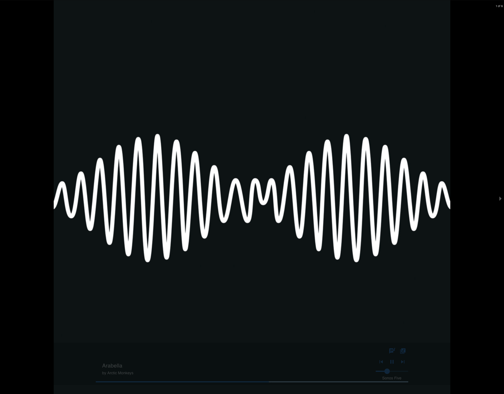
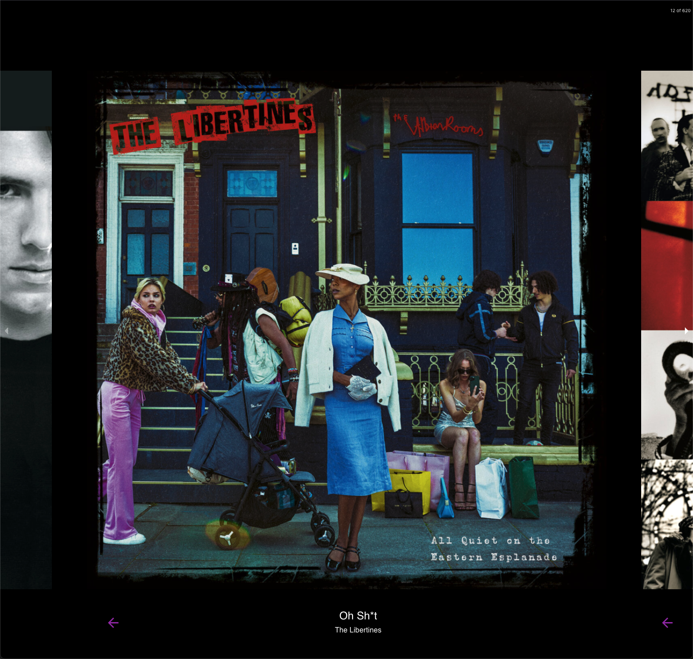

 
<h1>PlexArt Display</h1>


Welcome to PlexArt Display, a web application that brings your music to life. This project is all about showcasing your currently playing album art in a visually appealing way, turning your browser into a vibrant music hub.

PlexArt Display is more than just a pretty face. It offers basic music controls like play, pause, volume adjustment, and track navigation. But these controls are designed to be unobtrusive, appearing only when you need them, so the album art always takes center stage.

One of the key features of PlexArt Display is the ability to browse through your Plex devices. Imagine a slide show where each slide is a different device, and you can flip through them with a simple swipe.

But that's not all. PlexArt Display also has an 'Album Library' mode. Picture another slide show, this time with all the albums in your library. The slides change automatically, and the albums are chosen at random, so you never know what's coming next. It's like your own personal music lottery!

The end goal of PlexArt Display is to be a dedicated music display in your living room or media room. It's a way to add a touch of style and interactivity to your music listening experience.

## Features

PlexArt Display is packed with features designed to enhance your music listening experience:

- **Album Art Display**: The main feature of PlexArt Display is the ability to display the album art of the currently playing track. 
The album art takes up the entire screen, providing a visually appealing backdrop to your music.
- **Basic Music Controls**: PlexArt Display provides basic music controls including play, pause, volume adjustment, and track navigation.
These controls are designed to be unobtrusive, appearing only when you interact with the screen.
- **Lyrics Display**: If available, PlexArt Display can show the lyrics of the currently playing song.
- **Device Carousel**: Browse through all your Plex devices with a simple swipe. 
Each device is displayed as a slide in a carousel, making it easy to switch between devices.
- **Album Library Mode**: In Album Library mode, all the albums in your library are displayed in a carousel.
The carousel auto-plays, changing slides every few seconds. The albums are chosen at random, providing a unique and engaging experience every time.
- **Works with your Sonos devices**: If you start a playlist or album on a Sonos device, PlexArt Display will automatically switch to that device and display the album art.

## Configurations

PlexArt Display can be customized to suit your needs by setting configurations.
The first time you run the application, you will be prompted to enter your Plex token and other configurations.

- `PLEX_TOKEN`: MANDATORY. This is your Plex token. It's used to authenticate with your Plex server. 
You can find it by following this [guide](https://support.plex.tv/articles/204059436-finding-an-authentication-token-x-plex-token/).

- `HIDE_LIBRARY`: OPTIONAL. This is a comma-separated list of library sections you want to hide.
For example, if you have libraries named "Music" and "Podcasts" and you want to hide the "Podcasts" library.

- `PREFER_ORDER`: OPTIONAL. This is a comma-separated list of device names in the order you prefer them to be displayed.
For example, if you have devices named "Living Room", "Bedroom", and "Kitchen" and you want them to be displayed in that order,
If none of them are playing, but you have another device playing,
the currently playing will be displayed by default. As soon as any of your favorite devices start playing, it will be displayed instead.

Once you have set the configuration, if you ever want to change it again, navigate to `/config` in your browser.

## Screenshots

Player:


Album Library:


## Running with Docker Compose

You can easily run the application using Docker Compose.
I have published a Docker image of the application on the GitHub Container Registry, which you can use directly.

First, you need to create a `docker-compose.yml` file in your project directory with the following content:

```yaml
version: '3.8'
services:
  plexart:
    container_name: plexart
    restart: unless-stopped
    image: ghcr.io/gloaysa/plexart:latest
    ports:
      - '5000:5000'
```

## Roadmap
[] - Properly handle errors
[] - Libraries are hardcoded (only the first one is shown)
[] - Display playlists  
[] - Add the ability to start albums/playlists  
[] - Display art from external services (tidal)  

### Environment Variables

To run this project, you need to set the following environment variables in your `.env` file:

- `REACT_APP_PLEX_TOKEN`: Your Plex token. You can find it following this [guide](https://support.plex.tv/articles/204059436-finding-an-authentication-token-x-plex-token/).
- `REACT_APP_HIDE_LIBRARY`: A comma-separated list of library sections you want to hide.

## Development Guide

This project was bootstrapped with [Create React App](https://github.com/facebook/create-react-app).
It uses:

- [zustand](https://github.com/pmndrs/zustand) for state management.
- [wouter](https://github.com/molefrog/wouter) for routing.
- [react-response-carousel](https://github.com/leandrowd/react-responsive-carousel) for the carousel component.

### Available Scripts

In the project directory, you can run:

- `npm start`: Runs the app in the development mode. Open [http://localhost:3000](http://localhost:3000) to view it in the browser.
- `npm test`: Launches the test runner in the interactive watch mode.
- `npm run build`: Builds the app for production to the `build` folder.

### Serving with Nginx

After building the project with `npm run build`, you can serve it with Nginx. Here's a basic configuration you can use:

```nginx
server {
    listen 3000;
    server_name localhost;

    location / {
        root /path/to/your/build/folder;
        try_files $uri /index.html;
    }
}
```
