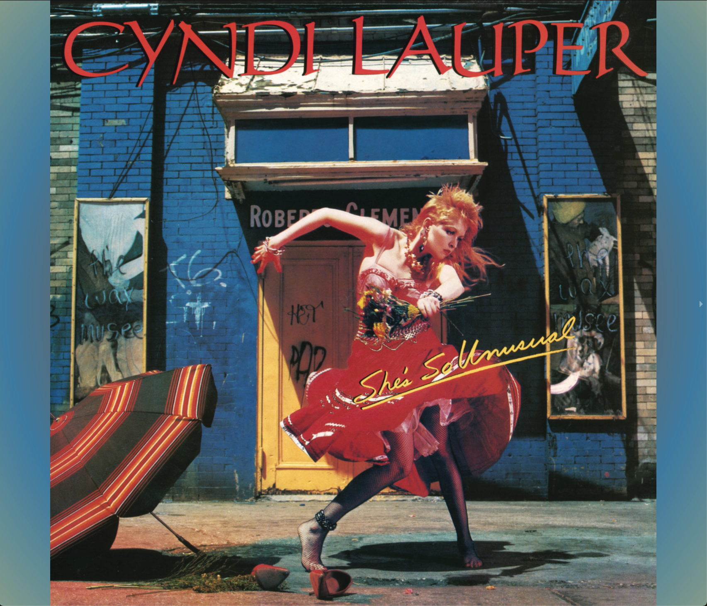
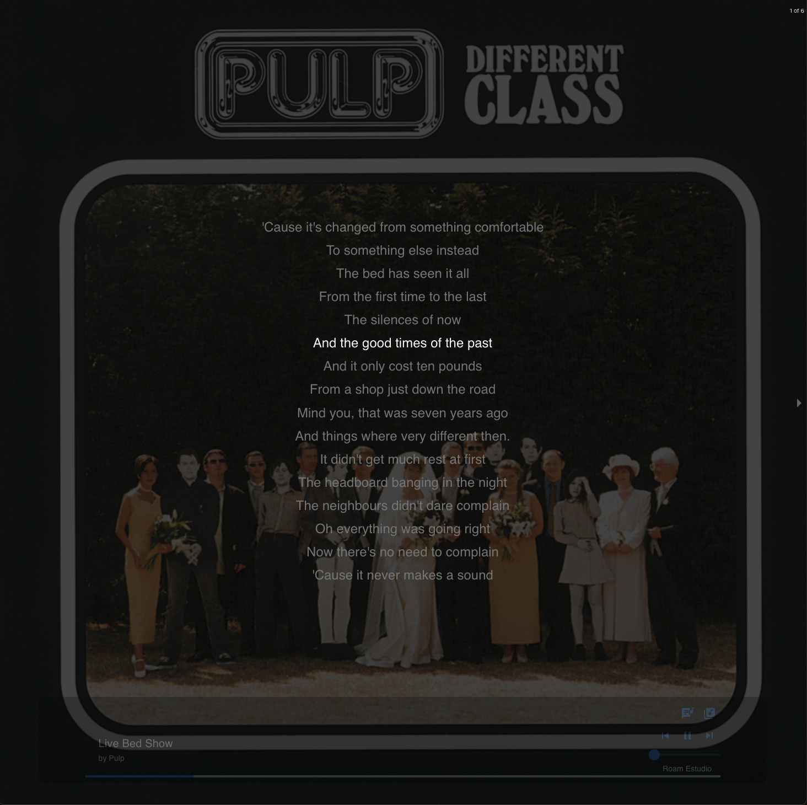
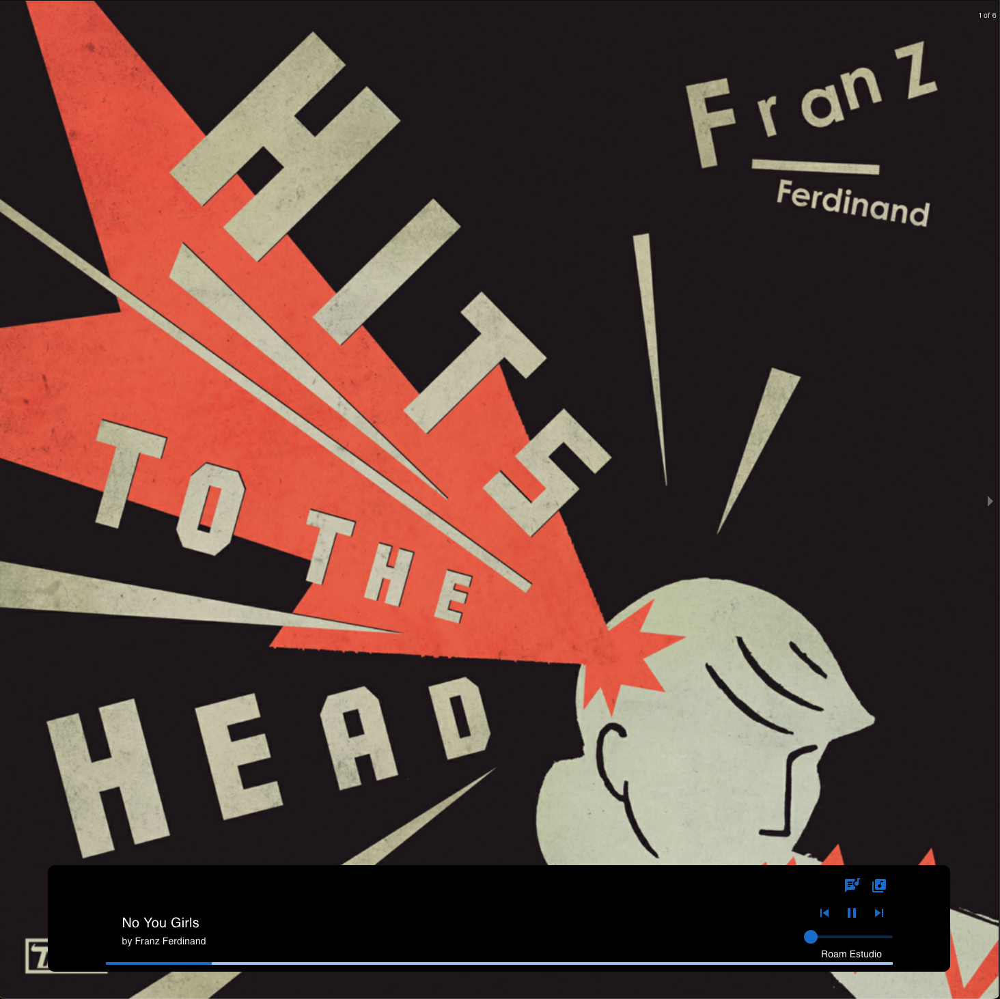

 
<h1>What's Playing</h1>

Welcome to **What's Playing**, a web application that brings your music cover art from Plex to live. This project is all about showcasing your currently playing album art in a visually appealing way, turning your browser into a vibrant music hub.

If your personal music collection don't have really good cover art, I created a [python script that will download them for you](https://github.com/gloaysa/whatsplaying/wiki/How-to-get-high-quality-covers-for-all-your-music). Please, read the instructions provided before using!

**What's Playing** is more than just a pretty face. It offers basic music controls like play, pause, volume adjustment, and track navigation. But these controls are designed to be unobtrusive, appearing only when you need them, so the album art always takes center stage.

One of the key features of **What's Playing** is the ability to browse through your Plex devices. Imagine a slide show where each slide is a different device, and you can flip through them with a simple swipe.

But that's not all. **What's Playing** also has an 'Album Library' mode. Picture another slide show, this time with all the albums in your library. The slides change automatically, and the albums are chosen at random, so you never know what's coming next. It's like your own personal music lottery!

The end goal of **What's Playing** is to be a dedicated music display in your living room or media room. It's a way to add a touch of style and interactivity to your music listening experience.

## Features

**What's Playing** is packed with features designed to enhance your music listening experience:

- **Album Art Display**: The main feature of **What's Playing** is the ability to display the album art of the currently playing track. 
The album art takes up the entire screen, providing a visually appealing backdrop to your music.
- **Basic Music Controls**: **What's Playing** provides basic music controls including play, pause, volume adjustment, and track navigation.
These controls are designed to be unobtrusive, appearing only when you interact with the screen.
- **Lyrics Display**: If available, **What's Playing** can show the lyrics of the currently playing song.
- **Device Carousel**: Browse through all your Plex devices with a simple swipe. 
Each device is displayed as a slide in a carousel, making it easy to switch between devices.
- **Album Library Mode**: In Album Library mode, all the albums in your library are displayed in a carousel.
The carousel auto-plays, changing slides every few seconds. The albums are chosen at random, providing a unique and engaging experience every time.
- **Works with your Sonos devices**: If you start a playlist or album on a Sonos device, **What's Playing** will automatically switch to that device and display the album art.
- **Blur Background**: The background of page is blurred with the main colors of the currently playing album.

## Screenshots

Player with blurred background:


Album Library:


Displaying lyrics:


Displaying controls (mouse hovering over the album art or touching the screen):


## Configurations

**What's Playing** can be customized to suit your needs by setting configurations.
The first time you run the application, you will be prompted to enter your Plex token and other configurations.

- `plexToken`: MANDATORY. This is your Plex token. It's used to authenticate with your Plex server. 
You can find it by following this [guide](https://support.plex.tv/articles/204059436-finding-an-authentication-token-x-plex-token/).

- `hideLibraries`: OPTIONAL. This is a comma-separated list of library sections you want to hide.
For example, if you have libraries named "Music" and "Podcasts" and you want to hide the "Podcasts" library.

- `preferredOrder`: OPTIONAL. This is a comma-separated list of device names in the order you prefer them to be displayed.
For example, if you have devices named "Living Room", "Bedroom", and "Kitchen" and you want them to be displayed in that order,
If none of them are playing, but you have another device playing,
the currently playing will be displayed by default. As soon as any of your favorite devices start playing, it will be displayed instead.

- `autoDisplayAlbums`: OPTIONAL. This is a boolean value that determines if the Album Library should start 
automatically if your media players are stopped/unreachable for 30 seconds. Defaults to false.

- `intervalBetweenAlbums`: OPTIONAL. This is the time in seconds between slides in the Album Library. Defaults to 30 seconds.

Once you have set the configuration, if you ever want to change it again, navigate to `/config` in your browser.

You can optionally pass this configurations in a `config.json` file located in the root of the project. If you are using
Docker, you can mount this file to `/app/config.json`.

```bash
docker run -v /path/to/config.json:/app/config.json -p 5000:5000 your-image-name
```

You will find an example down below if you are using docker-compose.

The config file should look like [this](./public/config.json)


## Running with Docker Compose

You can easily run the application using Docker Compose.
I have published a Docker image of the application on the GitHub Container Registry, which you can use directly.

First, you need to create a `docker-compose.yml` file in your project directory with the following content:

```yaml
version: '3.8'
services:
  whatsplaying:
    container_name: whatsplaying
    restart: unless-stopped
    image: ghcr.io/gloaysa/whatsplaying:latest
    environment:
      - PORT=5000 # default is 5000
    ports:
      - '5000:5000'
    volumes:
      - ./path_to_your_file/config.json:/app/config.json # optional
```

## Roadmap
[x] - Properly handle errors.  
[] - Libraries are hardcoded (only the first one is shown).  
[] - Display playlists.  
[] - Add the ability to start albums/playlists.  
[x] - Display art from external services (tidal).  
[x] - Allow configuration of Album library carousel time between slides.  
[x] - Allow configuration to autostart Album library if nothing is playing for 5 seconds.  

## Development Guide

- [vite](https://vitejs.dev/) for the build tool.
- [zustand](https://github.com/pmndrs/zustand) for state management.
- [wouter](https://github.com/molefrog/wouter) for routing.
- [react-response-carousel](https://github.com/leandrowd/react-responsive-carousel) for the carousel component.

### Available Scripts

In the project directory, you can run:

- `npm run dev`: Runs the app in the development mode. Open [http://localhost:5173](http://localhost:5173) to view it in the browser.
- `npm run build`: Builds the app for production to the `dist` folder.
- `npm run preview`: after building the project, you can preview it with a local server.

### Serving with Nginx

After building the project with `npm run build`, you can serve it with Nginx. Here's a basic configuration you can use:

```nginx
server {
    listen 3000;
    server_name localhost;

    location / {
        root /path/to/your/dist/folder;
        try_files $uri /index.html;
    }
}
```
